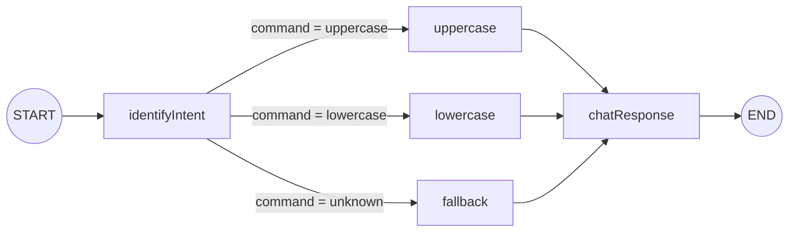

# 02 · LangChain Intro — Documentação da Aplicação

## Visão geral

Este projeto é uma aplicação de introdução ao **LangGraph** (biblioteca da família LangChain para orquestração de fluxos com estado). Ele expõe um servidor HTTP (**Fastify**) com um endpoint `POST /chat` que recebe uma mensagem de texto, faz essa mensagem passar por um **grafo de estados** e devolve o texto processado.

O grafo, por enquanto, não chama nenhum LLM — ele decide o que fazer com a mensagem por meio de uma checagem simples de palavras-chave (`upper` / `lower`) e aplica a transformação correspondente (maiúsculas/minúsculas). O objetivo pedagógico do projeto é demonstrar a estrutura básica de um grafo LangGraph: estado tipado, nós, roteamento condicional e arestas — a base sobre a qual, em exercícios futuros, entraria a chamada real a um modelo de linguagem.

## Principais tecnologias

| Tecnologia | Papel no projeto |
|---|---|
| [LangGraph](https://langchain-ai.github.io/langgraphjs/) (`@langchain/langgraph`) | Orquestra o fluxo como uma máquina de estados (`StateGraph`) |
| [LangChain](https://js.langchain.com/) (`langchain`, `@langchain/core`) | Fornece os tipos de mensagem (`HumanMessage`, `AIMessage`, `SystemMessage`) |
| [Fastify](https://fastify.dev/) | Servidor HTTP que expõe o endpoint `/chat` |
| [Zod](https://zod.dev/) | Define e valida o schema do estado do grafo (`GraphState`) |
| `@langchain/openai` | Dependência instalada para integração futura com a OpenAI (ainda não utilizada nos nós atuais) |
| Node.js test runner (`node:test`) | Testes end-to-end do endpoint |
| LangSmith (via variáveis de ambiente) | Observabilidade/tracing opcional das execuções do grafo |

## Estrutura de pastas

```
02-langchain-intro/
├── src/
│   ├── index.ts                     # Ponto de entrada: sobe o servidor Fastify na porta 3000
│   ├── server.ts                    # Cria a instância Fastify e define a rota POST /chat
│   └── graph/
│       ├── graph.ts                 # Define o estado (GraphState) e monta o StateGraph
│       ├── factory.ts               # Fábrica que expõe o grafo compilado (usada pelo langgraph.json)
│       └── nodes/
│           ├── identifyIntentNode.ts # Identifica a intenção (uppercase/lowercase/unknown)
│           ├── upperCaseNode.ts      # Converte o texto para maiúsculas
│           ├── lowerCaseNode.ts      # Converte o texto para minúsculas
│           ├── fallbackNode.ts       # Mensagem padrão quando a intenção não é reconhecida
│           └── chatResponseNode.ts   # Empacota a saída como AIMessage no histórico
├── tests/
│   └── router.e2e.test.ts           # Testes end-to-end do endpoint /chat
├── langgraph.json                   # Configuração para rodar o grafo com o LangGraph CLI/Studio
├── package.json                     # Scripts e dependências
├── tsconfig.json                    # Configuração do TypeScript
└── .env.example                     # Modelo das variáveis de ambiente (tracing do LangSmith)
```

## O grafo (`src/graph/graph.ts`)

### Estado (`GraphState`)

O estado é definido com Zod e representa os dados que trafegam entre os nós do grafo:

```ts
const GraphState = z.object({
    messages: withLangGraph(z.custom<BaseMessage[]>(), MessagesZodMeta), // histórico de mensagens (acumulado automaticamente pelo LangGraph)
    output: z.string(),                                    // texto atualmente em processamento
    command: z.enum(['uppercase', 'lowercase', 'unknown'])  // intenção identificada
})
```

- `messages`: lista de mensagens (`HumanMessage`/`AIMessage`) do LangChain. Usa o metadado `MessagesZodMeta`, que faz o LangGraph *concatenar* automaticamente novas mensagens ao histórico existente a cada passo, em vez de sobrescrevê-lo.
- `output`: string de trabalho que vai sendo transformada conforme passa pelos nós.
- `command`: resultado da etapa de identificação de intenção, usado para decidir o caminho do grafo.

### Nós (`src/graph/nodes/`)

| Nó | Arquivo | Responsabilidade |
|---|---|---|
| `identifyIntent` | `identifyIntentNode.ts` | Lê a última mensagem do usuário, verifica (em minúsculas) se contém `"upper"` ou `"lower"` e define `command`. Também copia a mensagem original para `output`. |
| `uppercase` | `upperCaseNode.ts` | Converte `output` para maiúsculas (`toUpperCase`). |
| `lowercase` | `lowerCaseNode.ts` | Converte `output` para minúsculas (`toLowerCase`). |
| `fallback` | `fallbackNode.ts` | Quando o comando não é reconhecido, substitui `output` por uma mensagem fixa orientando o usuário a tentar novamente. |
| `chatResponse` | `chatResponseNode.ts` | Envolve o `output` final em uma `AIMessage` e a adiciona ao array `messages`, fechando o histórico da conversa. |

### Fluxo / arestas



O roteamento condicional acontece em `addConditionalEdges`, logo após `identifyIntent`: uma função lê `state.command` e decide para qual nó seguir (`uppercase`, `lowercase` ou `fallback`). Todos os três caminhos convergem em `chatResponse`, que finaliza a execução.

## API HTTP (`src/server.ts`)

### `POST /chat`

Único endpoint exposto pela aplicação.

**Request body** (validado via JSON Schema do Fastify):

```json
{
  "question": "make this UPPERCASE please"
}
```

- `question` (string, obrigatório, mínimo de 5 caracteres): texto de entrada do usuário.

**Fluxo de processamento:**

1. O texto recebido em `question` é empacotado como uma `HumanMessage`.
2. O grafo é invocado (`graph.invoke`) com esse valor em `messages`.
3. O grafo identifica a intenção, aplica a transformação correspondente e gera a resposta.
4. O `output` final (string já transformada) é devolvido ao cliente.

**Exemplos de resposta:**

| `question` enviada | Intenção detectada | Resposta (`output`) |
|---|---|---|
| `"make THis message UPPER please!"` | `uppercase` | `"MAKE THIS MESSAGE UPPER PLEASE!"` |
| `"MAKE THIS MESSAGE LOWER PLEASE!"` | `lowercase` | `"make this message lower please!"` |
| `"HEY THERE!"` | `unknown` | `"Unknown command. Try 'make this uppercase' or 'convert to lowercase'"` |

**Erros:** qualquer exceção durante a execução do grafo é capturada e a rota responde com status `500` (sem corpo).

**Exemplo de chamada via `curl`** (documentado também em `src/index.ts`):

```bash
curl localhost:3000/chat --data '{"question": "uppercase this"}' -H "Content-type: application/json"
```

## Configuração de ambiente

O arquivo `.env.example` documenta as variáveis usadas para habilitar o **tracing do LangSmith** (observabilidade de execuções do LangChain/LangGraph):

```env
LANGSMITH_API_KEY=your-api-key
LANGCHAIN_TRACING_V2=true
LANGCHAIN_PROJECT=yt02-langchain-intro
```

Para rodar localmente, copie esse arquivo para `.env` e preencha `LANGSMITH_API_KEY` com uma chave válida (ou remova/ajuste as variáveis se não quiser habilitar o tracing).

## Scripts (`package.json`)

| Script | Comando | Descrição |
|---|---|---|
| `npm run dev` | `node --env-file .env --inspect --watch src/index.ts` | Sobe o servidor em modo desenvolvimento, com recarga automática (`--watch`) e depurador (`--inspect`), carregando variáveis do `.env`. |
| `npm test` | `node --env-file .env --test ./tests/**/*.test.ts` | Executa a suíte de testes end-to-end usando o test runner nativo do Node. |
| `npm run test:dev` | idem ao anterior, mas com `--watch` e `--inspect` | Modo de desenvolvimento para os testes. |
| `npm run langgraph:serve` | `npx @langchain/langgraph-cli@latest dev` | Sobe o **LangGraph Studio/CLI**, usando a configuração de `langgraph.json`, permitindo inspecionar visualmente o grafo (`agent`) definido em `src/graph/factory.ts`. |

## LangGraph CLI (`langgraph.json`)

```json
{
  "node_version": "20",
  "graphs": { "agent": "./src/graph/factory.ts:graph" },
  "env": ".env",
  "dependencies": ["."],
  "image_distro": "wolfi"
}
```

Esse arquivo é consumido pelo `@langchain/langgraph-cli`. Ele registra o grafo `agent`, exportado pela função `graph` em `src/graph/factory.ts`, permitindo executá-lo e depurá-lo fora do servidor Fastify (por exemplo, pelo LangGraph Studio) — útil para visualizar o fluxo do grafo e testar entradas manualmente.

## Testes (`tests/router.e2e.test.ts`)

Os testes usam `app.inject` do Fastify para simular requisições HTTP sem precisar abrir uma porta de rede, cobrindo os três caminhos do grafo:

1. Mensagem contendo "UPPER" → resposta em maiúsculas.
2. Mensagem contendo "LOWER" → resposta em minúsculas.
3. Mensagem sem palavra-chave reconhecida → mensagem de fallback.

Executar com:

```bash
npm test
```

## Como executar o projeto localmente

1. Instalar dependências:
   ```bash
   npm install
   ```
2. Criar o arquivo de ambiente:
   ```bash
   cp .env.example .env
   ```
   (preencha `LANGSMITH_API_KEY` se quiser habilitar o tracing; caso contrário pode deixar como está ou remover as variáveis)
3. Subir o servidor:
   ```bash
   npm run dev
   ```
4. Testar o endpoint:
   ```bash
   curl localhost:3000/chat --data '{"question": "make this UPPERCASE"}' -H "Content-type: application/json"
   ```

## Observações sobre o estado atual do código

- A identificação de intenção é feita por correspondência simples de substring (`includes('upper')` / `includes('lower')`), não por um LLM — é um ponto de partida didático para, em módulos seguintes, ser substituído por um roteamento feito por modelo de linguagem.
- A dependência `@langchain/openai` já está instalada no projeto, mas nenhum nó atual a utiliza — sinaliza que a integração com um modelo real da OpenAI é um próximo passo natural do curso.
- Em `src/graph/nodes/identifyIntentNode.ts` há uma linha solta `PerformanceEntry` (linha 14) que não tem efeito funcional, mas é código residual/inválido que vale revisar.
