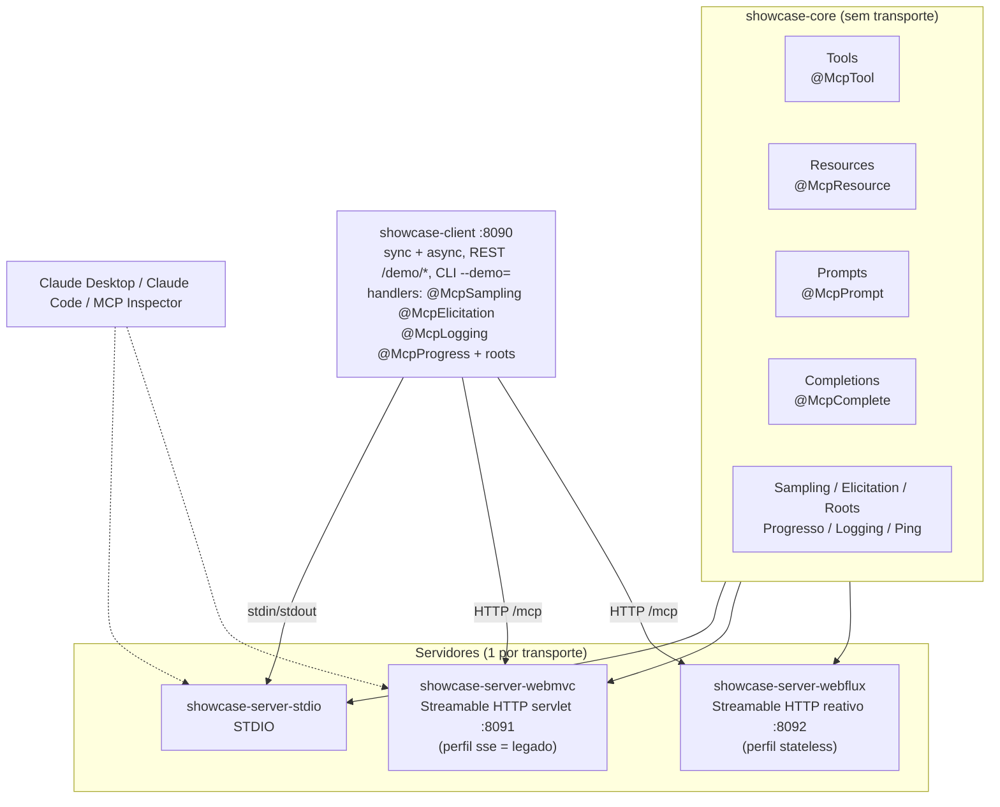

# MCP Java Showcase

Projeto de referência que demonstra **todos os recursos do [MCP Java SDK](https://github.com/modelcontextprotocol/java-sdk)** usando Spring Boot com os starters MCP do Spring AI. Cada capacidade do protocolo tem implementação real, teste que a prova e uma demo executável — o mapa completo está em [`docs/capacidades.md`](docs/capacidades.md).

## MCP em 10 linhas

1. O **Model Context Protocol** padroniza como aplicações de IA conversam com ferramentas e dados externos.
2. Um **servidor MCP** expõe capacidades; um **cliente MCP** (Claude Desktop, IDE, seu app) as consome.
3. **Tools** são funções que o modelo pode chamar, com entrada e saída descritas por JSON Schema.
4. **Resources** são dados endereçados por URI que o cliente lê — estáticos ou por template (`showcase://products/{sku}`).
5. **Prompts** são modelos de conversa prontos que o usuário escolhe.
6. **Completions** dão autocompletar para argumentos de prompts e templates.
7. O protocolo é bidirecional: com **sampling** o servidor pede uma geração ao LLM do cliente; com **elicitation** pede dados ao usuário; com **roots** lê as pastas de trabalho que o cliente autoriza.
8. Notificações assíncronas cobrem **progresso**, **log estruturado** e **mudanças de lista** (tools/resources/prompts).
9. A mensagem viaja por **STDIO** (subprocesso local) ou **Streamable HTTP** (endpoint único `/mcp`); o SSE de dois endpoints é legado.
10. Tudo é JSON-RPC 2.0 com negociação de capabilities no `initialize` — cada lado só usa o que o outro declarou suportar.

## Arquitetura do monorepo



## Pré-requisitos

- Java 21+ (`java -version`)
- Docker + Docker Compose (só para a execução conteinerizada)
- Nada de chave de API: o sampling usa um provedor **mockado** por padrão. Um LLM real (Anthropic) é opcional via perfil `real-llm` + `ANTHROPIC_API_KEY`.

O Maven vem embutido (`./mvnw`).

## Como rodar

### Build e testes

```bash
./mvnw verify          # 23 testes unitários + 18 de integração (3 transportes + stateless)
```

### Local, módulo a módulo

```bash
# servidores HTTP (terminais separados)
java -jar showcase-server-webmvc/target/showcase-server-webmvc-1.0.0-SNAPSHOT.jar    # :8091
java -jar showcase-server-webflux/target/showcase-server-webflux-1.0.0-SNAPSHOT.jar  # :8092

# cliente como API REST (:8090) — sobe também o servidor STDIO como subprocesso
java -jar showcase-client/target/showcase-client-1.0.0-SNAPSHOT.jar

# ou cliente como CLI: roda as demos e sai
java -jar showcase-client/target/showcase-client-1.0.0-SNAPSHOT.jar --demo=all
java -jar showcase-client/target/showcase-client-1.0.0-SNAPSHOT.jar --demo=sampling
```

Com o cliente no ar:

```bash
curl http://localhost:8090/demo                        # catálogo de demos
curl -X POST http://localhost:8090/demo/elicitation    # executa (JSON)
curl http://localhost:8090/demo/roots/text             # executa (texto puro)
curl http://localhost:8090/demo/notifications          # notificações recebidas
```

### Docker

```bash
docker compose up --build
# aguarde os healthchecks e então:
curl http://localhost:8090/demo
```

> **Máquina com pouca RAM sobrando?** O `--build` compila as 3 imagens em paralelo
> (3 builds Maven simultâneos) e pode congelar o sistema se IDE e navegador já
> estiverem consumindo a memória. Serialize o build com:
>
> ```bash
> COMPOSE_PARALLEL_LIMIT=1 docker compose up --build
> ```
>
> Em runtime os containers são leves: o compose limita cada um a 768 MB / 2 CPUs.

Variáveis de ambiente de cada imagem estão documentadas no `Dockerfile` do módulo. O servidor STDIO tem imagem própria para uso com `docker run -i` (não entra no compose — ele é um subprocesso de quem o consome, não um serviço de rede).

### Sampling com LLM real (opcional)

```bash
export ANTHROPIC_API_KEY=sk-ant-...
# local-stdio mantem a conexao STDIO (ela e um perfil default, desligado ao ativar outros)
java -jar showcase-client/target/showcase-client-1.0.0-SNAPSHOT.jar \
     --spring.profiles.active=local-stdio,real-llm --demo=sampling
```

## Plugando nos clientes MCP

### Claude Desktop / Claude Code (STDIO)

`claude_desktop_config.json` (Desktop) ou `.mcp.json` (Claude Code):

```json
{
  "mcpServers": {
    "mcp-java-showcase": {
      "command": "java",
      "args": [
        "-jar",
        "/CAMINHO/ABSOLUTO/mcp-java-showcase/showcase-server-stdio/target/showcase-server-stdio-1.0.0-SNAPSHOT.jar"
      ]
    }
  }
}
```

No Claude Code também dá por linha de comando:

```bash
claude mcp add showcase -- java -jar /CAMINHO/ABSOLUTO/showcase-server-stdio-1.0.0-SNAPSHOT.jar
```

### Claude Code / clientes HTTP (Streamable HTTP)

Com um servidor HTTP no ar (`:8091` ou `:8092`):

```bash
claude mcp add --transport http showcase-http http://localhost:8091/mcp
```

```json
{
  "mcpServers": {
    "showcase-http": { "type": "http", "url": "http://localhost:8091/mcp" }
  }
}
```

### MCP Inspector

```bash
# STDIO
npx @modelcontextprotocol/inspector java -jar showcase-server-stdio/target/showcase-server-stdio-1.0.0-SNAPSHOT.jar

# Streamable HTTP: abra o Inspector, transporte "Streamable HTTP", URL http://localhost:8091/mcp
npx @modelcontextprotocol/inspector
```

No Inspector você enxerga as 14 tools, 3 resources, 2 templates, 3 prompts, completions, e pode testar `logging/setLevel`, subscription e elicitation interativamente.

## Decisões e limitações (resumo)

Detalhes em [`docs/capacidades.md`](docs/capacidades.md), seção "Notas honestas":

- **Versões**: Spring AI **2.0.0** + MCP Java SDK **2.0.0** + Spring Boot **4.1.0** (BOMs no pom raiz). O transporte é escolhido por propriedade (`spring.ai.mcp.server.protocol`), não por artefato.
- **Servidores em SYNC**: os callbacks async do Spring AI só injetam `McpAsyncRequestContext`; a API async é demonstrada no cliente.
- **SDK puro onde o starter não chega**: handler de roots do servidor, capabilities com `subscribe=true`, notificações de list-changed/updated e o cliente async — cada caso comentado no próprio código.
- **SSE legado**: perfil `sse` no módulo webmvc, apenas para compatibilidade.
- **Stateless**: o scanner pula tools bidirecionais no boot (sem sessão não há canal servidor→cliente) — comportamento coberto por teste.
- **Testcontainers**: não usado; os ITs conectam o cliente real do SDK a servidores reais em porta aleatória, e as imagens Docker são validadas pelo `docker compose up`. Um teste com Testcontainers só re-embrulharia o mesmo cenário, mais lento.

## Módulos

| Módulo | O que faz |
|---|---|
| [showcase-core](showcase-core/README.md) | Todas as capacidades MCP em um único lugar, **independente de transporte**: 14 tools (`@McpTool`), 3 resources + 2 templates (`@McpResource`), 3 prompts (`@McpPrompt`), completions (`@McpComplete`), sampling, elicitation, roots, progresso, logging e ping. Os servidores só apontam o component scan para cá. |
| [showcase-server-stdio](showcase-server-stdio/README.md) | Servidor com transporte **STDIO** (JSON-RPC por stdin/stdout), o formato que Claude Desktop, Claude Code e MCP Inspector usam para subir servidores locais como subprocesso. Stdout é reservado ao protocolo; o log vai para arquivo. |
| [showcase-server-webmvc](showcase-server-webmvc/README.md) | Servidor **Streamable HTTP síncrono** na pilha servlet (Spring MVC + Tomcat), porta 8091, endpoint único `/mcp`. Mantém também o perfil `sse` com o transporte SSE legado, só para clientes antigos. |
| [showcase-server-webflux](showcase-server-webflux/README.md) | Servidor **Streamable HTTP reativo** (WebFlux + Netty, I/O não bloqueante), porta 8092, endpoint `/mcp`. O perfil `stateless` demonstra o modo sem sessão, em que as tools bidirecionais são puladas no boot. |
| [showcase-client](showcase-client/README.md) | Cliente Spring Boot que conecta **nos três servidores ao mesmo tempo** (STDIO como subprocesso + 2× HTTP) e exercita todas as capacidades: 17 demos via REST (`:8090/demo/*`) ou CLI (`--demo=`), handlers de sampling/elicitation/logging/progresso e declaração de roots. Inclui também a variante async do SDK. |
